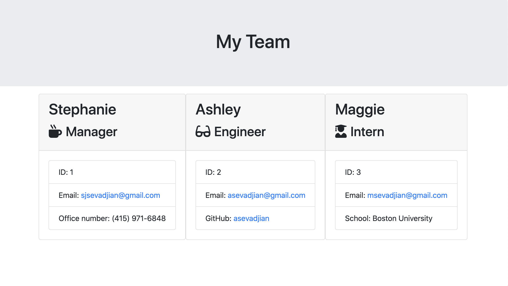

## Meet the Team

## Summary

Running the app.js file in node prompts the user to enter the name and contact information of the team, starting with the manager.

After entering the manager information, the user is prompted to add other members of the team (either an engineer, or an intern).

After entering in all the other team members, the user can select not to add any additional team members.

At that point the code is exited and the team.html file is generated in the output folder.

Opening the team.html file then displays the added team members.

## Screenshot

## GitHub Repo Link

https://github.com/ssevadjian/Meet-the-Team

